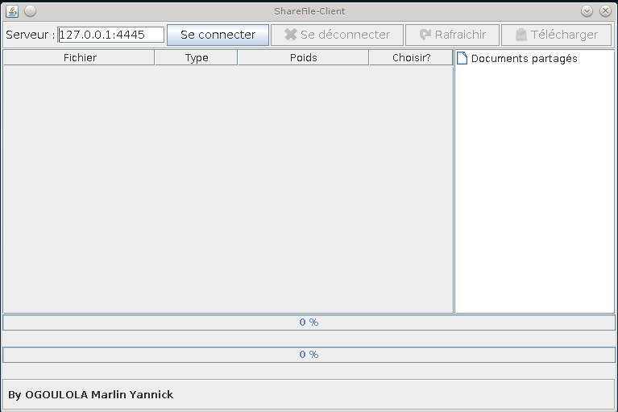
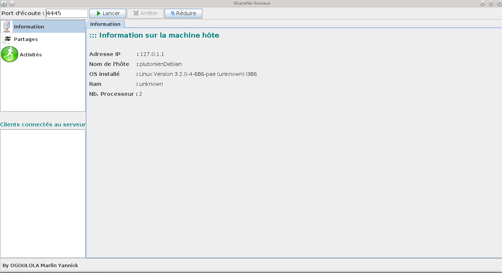

# sharefiles
Système simplifié des partages des fichiers en réseau
# Objectifs Visés 
* Une puce
* Une autre puce
* Et encore une autre puce !

*Source orignina*l : http://codes-sources.commentcamarche.net/source/100768-sharefiles

